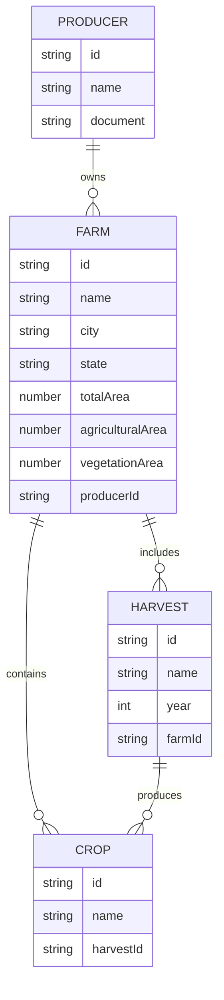

# Diagrama de entidades e relacionamentos

## Objetivo

Apresentar o modelo de dados principal do sistema **Agro Manager** por meio de um Diagrama Entidade-Relacionamento (ER), definindo as entidades centrais, seus atributos e os relacionamentos entre elas.

## Descrição das entidades

### 1. Producer

Representa o produtor rural, responsável pela gestão das fazendas.

**Atributos principais**

- id: identificador único do produtor
- name: nome do produtor
- document: documento de identificação (CPF ou CNPJ)

### 2. Farm

Representa a fazenda ou propriedade rural pertencente a um produtor.

**Atributos principais**

- id: Identificador único da fazenda
- name: nome da fazenda
- city: cidade onde a fazenda está localizada
- state: estado da fazenda
- totalArea: área total da fazenda em hectares
- agriculturalArea: área destinada ao cultivo agrícola
- vegetationArea: área coberta por vegetação natural
- producerId: referência ao produtor proprietário da fazenda

### 3. Harvest

Representa a safra ou colheita realizada em uma fazenda em um determinado ano.

**Atributos principais**

- id: identificador único da safra
- name: nome da safra ou colheita
- year: ano em que a colheita foi realizada
- farmId: referência à fazenda onde ocorreu a colheita

### 4. Crop

Representa as culturas agrícolas cultivadas dentro de uma fazenda ou durante uma colheita.

**Atributos principais**

- id: identificador único da cultura
- name: Nome da cultura (ex: soja, milho)
- harvestId: referência à safra ou colheita relacionada

## ERD

## Change log

| Responsável     | Criado em  | Versão | Atualizado em |
| --------------- | ---------- | ------ | ------------- |
| Anderson Vieira | 2025-10-06 | 001    | 2025-10-06    |
