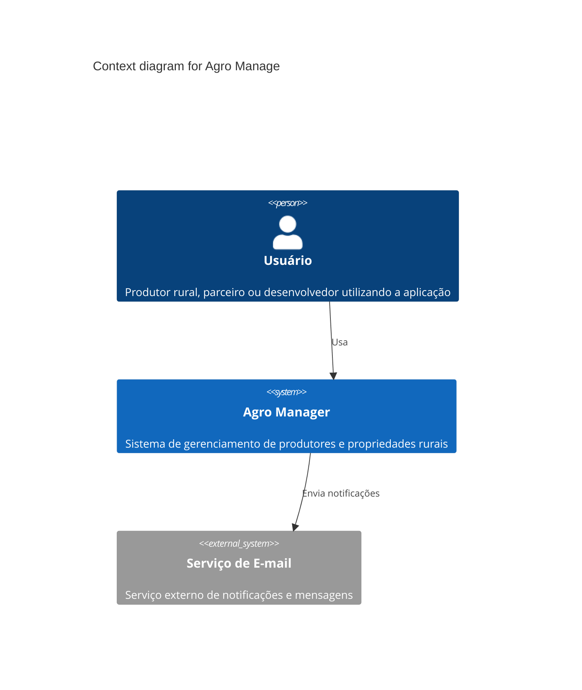
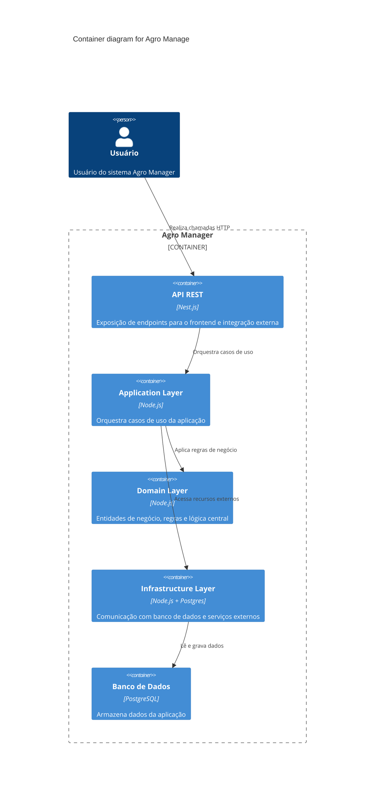
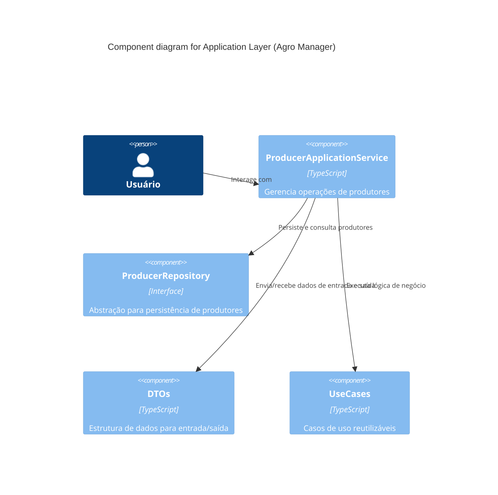

# C4 Model

## Objetivo

Este documento apresenta os principais diagramas de arquitetura baseados no modelo C4.

### 1. Context diagram

### 2. Container diagram

### 3. Component diagram

## Change log

| Responsável     | Criado em  | Versão | Atualizado em |
| --------------- | ---------- | ------ | ------------- |
| Anderson Vieira | 06-10-2025 | 001    | 06-10-2025    |
