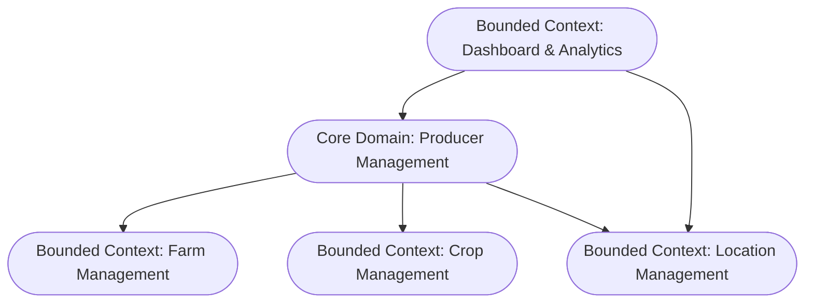

# Bounded contexts

## Objetivo

Apresentar a divisão do domínio do sistema em contextos delimitados, conforme os princípios do Domain-Driven Design (DDD). Através dessa delimitação clara, busca estabelecer fronteiras bem definidas para as funcionalidades, regras de negócio e modelos que compõem o sistema.

## Bounded context diagram

## Contextos

### 1. Core Domain: Producer Management

Responsável pelas regras de negócio centrais do sistema relacionadas ao cadastro e manutenção dos produtores rurais.

**Entidades principais**

- Producer

**Responsabilidades**

- Criar, editar, remover produtores
- Garantir integridade das informações vinculadas às propriedades e safras
- Aplicar validações de regras de negócio, como a soma das áreas

**Relacionamentos**

- Depende de dados do Farm Management (propriedades)
- Depende de dados do Crop Management (culturas e safras)
- Depende de dados do Location Management (cidade e estado)

### 2. Farm Management

Gerencia as informações das propriedades rurais associadas aos produtores.

**Entidades principais**

- Farm

**Responsabilidades**

- Criar, editar e excluir fazendas
- Validar dados como área total e área agricultável
- Expor API para consumo pelo contexto de Producer Management

### 3. Crop Management

Gerencia as safras e culturas associadas às propriedades.

**Entidades principais**

- Crop
- Harvest

**Responsabilidades**

- Permitir o registro de culturas por safra e fazenda
- Relacionar com propriedades existentes

### 4. Location Management

Gerencia a estrutura de localidades (estado e cidade).

**Entidades principais**

- State
- City

**Responsabilidades**

- Fornece dados normalizados de localização
- Reutilizável em diversos contextos, inclusive Dashboard

### 5. Dashboard

Responsável por gerar visualizações e relatórios sobre os dados do sistema.

**Responsabilidades**

- Fornecer KPIs como total de fazendas, hectares, distribuição por estado
- Gerar gráficos com base em dados agregados dos outros contextos

**Relacionamentos**

- Lê dados dos contextos Producer, Farm, Crop e Location

## Notas de Design

O contexto **Location Management** está inserido apenas de forma representativa, portanto, não será implementado inicialmente.

Os dados de Location seriam tratados como contexto compartilhado (Shared Kernel), por serem consumidos por múltiplos domínios.

## Change log

| Responsável     | Criado em  | Versão | Atualizado em |
| --------------- | ---------- | ------ | ------------- |
| Anderson Vieira | 2025-10-06 | 001    | 2025-10-06    |
